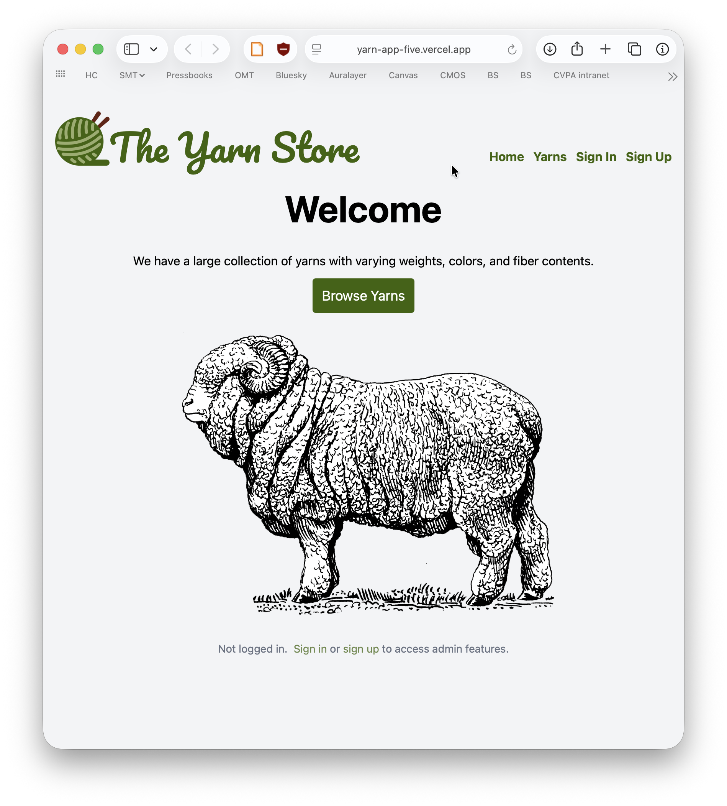
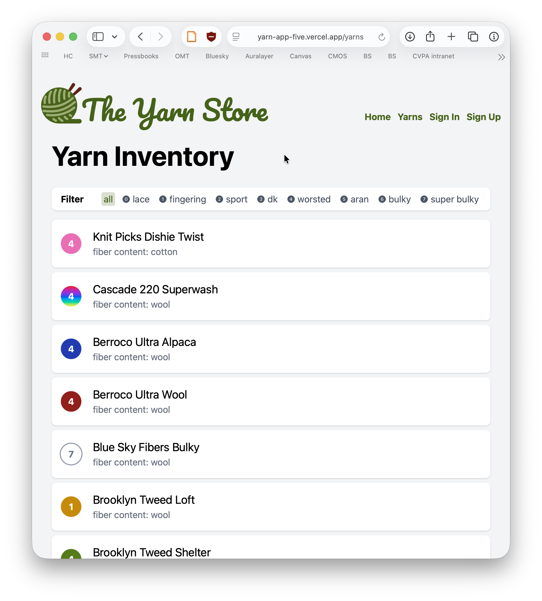
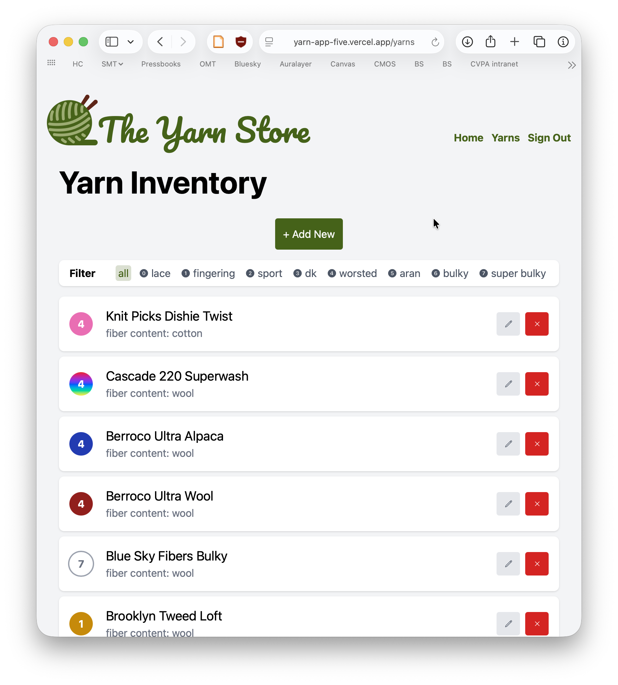
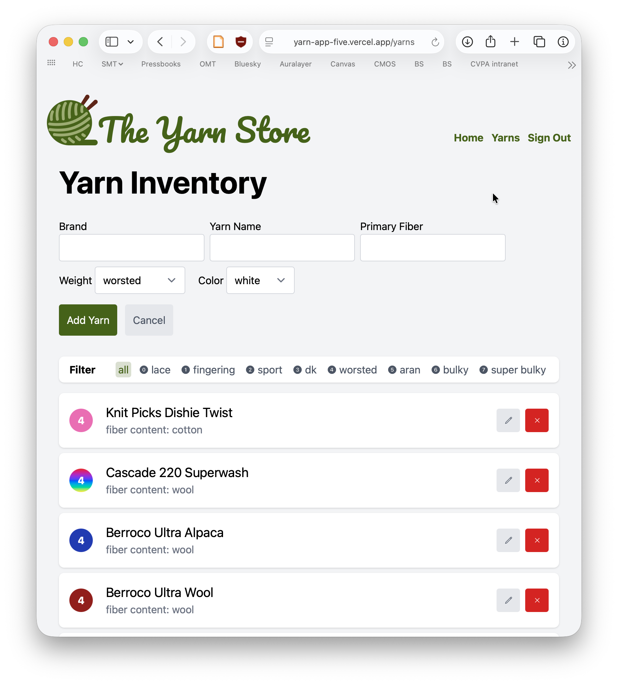
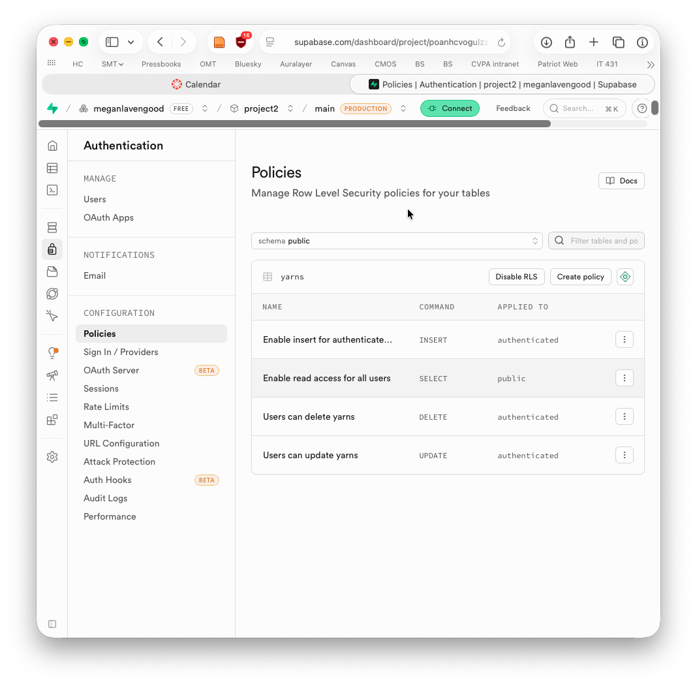

---
geometry:
    - margin=1in
colorlinks: true
---

# Project 2: Yarn App

Megan Lavengood • IT 431 • Spring 2026

- [Description](#description)
- [Screenshots](#screenshots)
  - [Home](#home)
  - [Product view (anonymous viewer)](#product-view-anonymous-viewer)
  - [Product view (authenticated user)](#product-view-authenticated-user)
  - [Add/Edit form (authenticated user)](#addedit-form-authenticated-user)
  - [Supabase screenshot RLS](#supabase-screenshot-rls)

---

## Description

I'm a knitter so I decided to make an app that would mimic what a yarn store might display. (Unfortunately I couldn't think of a good real-life use case to work on.) I decided to track yarn brands, names, weights (thicknesses, not like mass), colors, and fiber content. I based the sample data off my real-life stash of yarn.

I decided to use the React Router template. Once I had the template it was easy to edit it to suit my needs. I made a couple changes from the provided template:

1. I wanted the new yarn form to appear on the page without hiding the yarn list
2. I added a footer and put the email display down there.
3. I added an `updated_at` field and sorted the list by that, so that when a yarn is edited it pops to the top of the list. This makes it easier to see the changes.

For styling, I experimented with Tailwind CSS for the first time ever. Some aspects of it are definitely nice but I missed some of the built-in styling that comes with Bootstrap. I put some hours into styling and making the responsive aspects work well so I hope that's appreciated! I get really into UI design.

## Screenshots

### Home

### Product view (anonymous viewer)

### Product view (authenticated user)

### Add/Edit form (authenticated user)

### Supabase screenshot RLS

